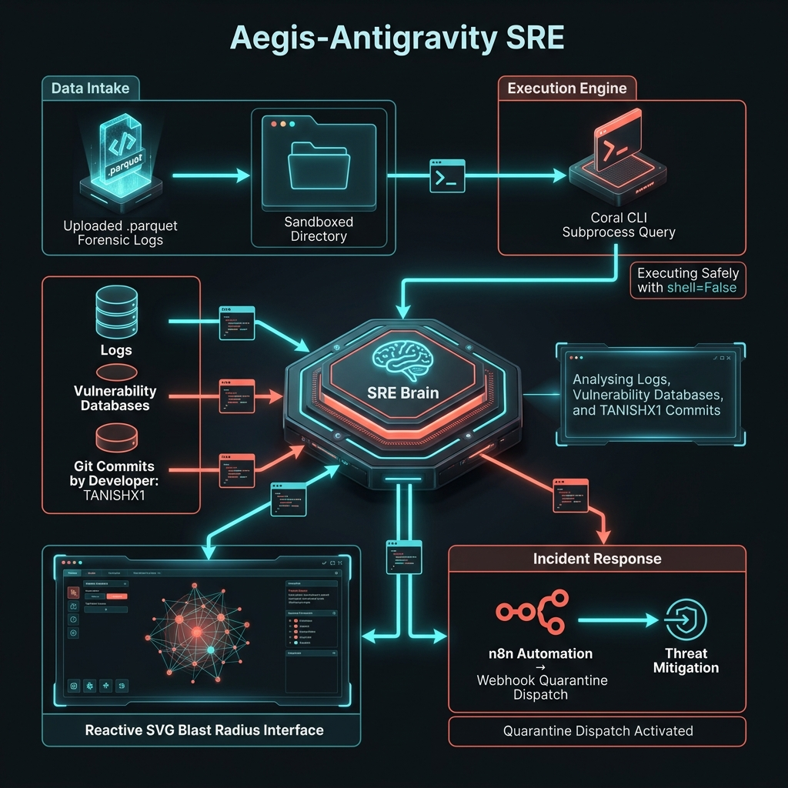
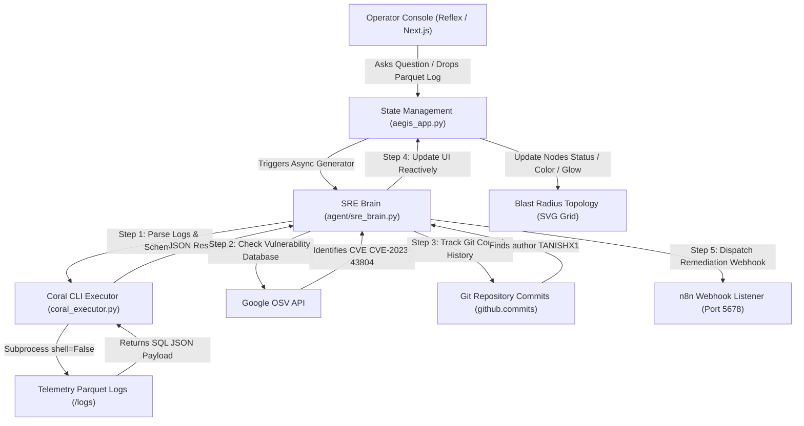

# 🛡️ Aegis-Antigravity SRE
### Zero-Warehouse Root-Cause Investigation & Cyber-Incident Remediation Agent
*Developed for **Track 1** of the **"Pirates of the Coral-bean" Hackathon***

---



Aegis-Antigravity SRE is a next-generation, high-performance incident response platform built entirely in **pure Python** using the Reflex framework (Next.js/React compiled frontend + FastAPI backend). 

Operating on a **Zero-Warehouse** philosophy, Aegis enables cybersecurity teams to query, join, and inspect telemetric forensic logs (Parquet format) locally, cross-reference vulnerabilities in real-time, trace security leaks back to specific git committers (such as developer `TANISHX1`), and dispatch automated remediation protocols via resilient webhooks—**all without the overhead of heavy third-party datastores.**

---

## 🧭 System Architecture & Data Flow

Aegis-Antigravity SRE utilizes a highly modular multi-hop cognitive layout where the agent orchestrates federated SQL log analysis, package vulnerability lookups, and webhook mitigation dispatches.



---

## ✨ Core Engineering Innovations

### 1. Zero-Warehouse Federated Analytics (`tools/coral_executor.py`)
* **Subprocess Sandboxing**: Executes `coral sql "<query>" --format json` on raw log files using `shell=False` parameters, fully preventing injection attacks.
* **Resource Guarding**: Enforces strict `timeout=30.0` execution thresholds to cleanly terminate runaway Cartesian joins, eliminating CPU and thread starvation.
* **Error Self-Correction**: Translates system/syntax errors into structured JSON output, giving the LLM brain the context it needs to self-correct and adjust SQL queries dynamically.

### 2. Network-Resilient Webhook Dispatch (`tools/n8n_dispatcher.py`)
* **Exponential Backoff**: Integrates `urllib3` retry adapters that absorb system packet loss, local network jitter, and webhook listener cold-starts (retries up to 3 times with backoffs: 1s, 2s, 4s).
* **Resilient Timeouts**: Configures explicit connection (`3.05s`) and read (`10.0s`) split-timeouts to prevent slow remote receivers from locking the primary server.

### 3. Asynchronous Cognitive Loop (`agent/sre_brain.py`)
* **Multi-Hop Schema Joints**: Prompts guide the agent through multi-stage federated SQL joins spanning telemetry tables, git commits, and Google's OSV vulnerability records.
* **Dynamic Gen-Streaming**: Leverages Python async generators to stream intermediate thoughts and active tool calls to the client in real-time, giving operators complete transparency during multi-step tracing.

### 4. High-Fidelity Cyber-Incident Dashboard (`aegis_app/aegis_app.py`)
* **Pure Python Reactive UI**: Implements Next.js-compiled frontend reactive controls without writing a single line of JavaScript. Uses WebSocket state syncs for smooth interactions.
* **Neon Blast Radius Topology**: A custom visual SVG map renders compromise vectors at 60fps. Tapping nodes dynamically highlights vulnerability cards (such as urllib3 CVE commits) and outputs isolated rollback commands.

---

## 📂 Project Blueprint

The workspace is organized into highly specialized modules:

```
aegis-antigravity-sre/
├── requirements.txt                   # Pin-pointed Python system package declarations
├── rxconfig.py                        # Reflex project compilation and app configuration
├── test_runner.py                     # Command-line integration test-runner (dry-run ready)
├── README.md                          # Comprehensive user and architectural manual
├── logs/                              # Directory holding local forensic logs (e.g. Parquet files)
├── assets/
│   └── aegis_technical_architecture.png # Premium high-fidelity Unreal Engine style technical dataflow graphic
├── tools/
│   ├── __init__.py                    # Utilities package exports
│   ├── coral_executor.py              # Secure subprocess Coral CLI runner
│   └── n8n_dispatcher.py              # Resilient HTTP webhook dispatch adapter
├── agent/
│   ├── __init__.py                    # Core agent package exports
│   └── sre_brain.py                   # Async OpenAI cognitive brain and tool bindings
└── aegis_app/
    ├── __init__.py                    # Reflex UI application exports
    └── aegis_app.py                   # Dynamic dashboard, SVG reactive map, State handlers
```

---

## 🚀 Setting Up the Environment

### 1. Ingest Python Dependencies
Initialize a dedicated virtual environment in Fedora or Linux and load the system packages:
```bash
# Create local virtualenv to isolate libraries
python3 -m venv venv
source venv/bin/activate

# Installpinned system manifest
pip install -r requirements.txt
```

### 2. Define Environment Config
Create a `.env` file in the root of the project to specify your connection credentials:
```ini
OPENAI_API_KEY=your-openai-api-key-here
SRE_LLM_MODEL=gpt-4o
N8N_WEBHOOK_URL=http://localhost:5678/webhook/aegis-sre-remediate
```
> [!NOTE]
> If `OPENAI_API_KEY` is omitted, the SRE Brain automatically engages **Simulated Mock Mode**. It will generate mock SQL responses, trace vulnerability CVEs, and dispatch fake webhook responses, making it perfect for dry-run setups!

### 3. Run Standalone Diagnostic Tests
Confirm tool integration, retry adapters, and cognitive generators are fully functional by executing the terminal verification script:
```bash
python3 test_runner.py
```

### 4. Launch the Web Application
Start both the React/Next.js frontend and the FastAPI backend server with one command:
```bash
# Compile and bootstrap the dev environment
reflex run
```
Once compilation completes, open your browser and navigate to:
👉 **[http://localhost:3000](http://localhost:3000)**

---

## 🔍 Step-by-Step Incident Investigation Flow

Test the platform with this sample incident triage script:

1. **Upload Telemetry**: Drag a Parquet telemetry log (e.g. `auth_logs.parquet`) into the **Forensic Control** dropzone on the left panel. This writes the file safely into `./logs/`.
2. **Launch a Query**: Select one of the preloaded playbooks (e.g. **Zero-Warehouse Join**) or type a custom command like:
   > *"Check if any of our active telemetry nodes have critical CVE vulnerability packages, find who committed them, and trigger immediate mitigation."*
3. **Trace Thoughts**: Observe the **Agent Cognitive Log** panel stream intermediate logical milestones, detailing how it constructs SQL queries to join database telemetry, osv records, and git commits.
4. **Audit Topology**: View the **Blast Radius Topology** graph on the right panel.
   - Click compromised nodes (flashing neon coral/red) to load their details.
   - Review service names, cluster IPs, active CVE descriptions, and the targeted rollback commands.
5. **Observe Remediation**: Watch the cognitive loop detect that the author of the compromised code is `TANISHX1`, mark the node for quarantine, and successfully fire the resilient webhook to n8n to apply containment patches.

---

> [!TIP]
> **Production Deployment Recommendation**: If containerizing, ensure the `/logs` directory is mapped as a secure local volume, and configure your firewall to restrict direct subprocess execution commands strictly to the Coral CLI namespace.
